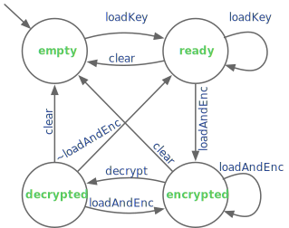

Homework 2 - Chisel State
=======================

Adopting our agile mindset, some of these problems revise components introduced in prior homework assignments. Although we provide a skeleton for testers, you will need to implement them in order to use them. Be sure not to modify external IO interfaces to maintain compatability with the autograder.

# Problem 1 - Improved ComplexALU (15 pts)
> Let's enhance our `ComplexALU` from HW1 using `Bundle`s and encapsulation. This problem will consist of multiple parts that build from each other. 
### Part 1 - ComplexNum 
> Implement the `ComplexNum` bundle in `src/main/scala/hw2/Complex.scala` by adding two `SInt` fields: `real` and `imag` and four methods with the following signatures:
> ```scala
>    def sumReal(that:  ComplexNum): SInt 
>    def sumImag(that:  ComplexNum): SInt 
>    def diffReal(that: ComplexNum): SInt
>    def diffImag(that: ComplexNum): SInt
> ``` 
> The goal of these methods is to effectively overload the `+` and `-` operators so we can easily work with `ComplexNum` in future modules while hiding implementation details. Make sure the arithmetic methods allow for bit width growth.

### Part 2 - ComplexALUIO
> Implement the `ComplexALUIO` bundle in `src/main/scala/hw2/Complex.scala` by adding three `Input` fields: 
> ```scala
>   doAdd: Option[Bool]
>   c0: ComplexNum
>   c1: ComplexNum
> ```
> and one `Output` field: 
>   ```scala
>   out: ComplexNum
> ```
> Ensure the width of `out` allows for bit width growth. For help with optional IO see the [cookbook](https://www.chisel-lang.org/chisel3/docs/cookbooks/cookbook.html#how-do-i-create-an-optional-io).

### Part 3 - ComplexALU 
> Implement the `ComplexALU` module in `src/main/scala/hw2/Complex.scala` using only the methods defined in `ComplexNum` to perform arithmetic. It will behave similarly to HW1, except that if the `onlyAdder` parameter is true, the generated hardware will not even include a port for `doAdd`.
>> - if `doAdd` is high, sum the real inputs and sum the imaginary inputs
>> - if `doAdd` is low, find difference between the real inputs and the difference between the imaginary inputs
>> - if `onlyAdder` is true, only generate logic to sum the real inputs and sum the imaginary inputs. Since we no longer need `doAdd`, it should be absent from the Verilog.


# Problem 2 - Improved PolyEval (15 pts)
> Let's enhance our `PolyEval` from HW1 to support arbitrary polynomials. Implement the `PolyEval` module in `src/main/scala/hw2/PolyEval.scala`. The `coefs` parameter is a list of coefficients ordered by ascending exponent powers. The generated hardware should produce the result combinatorally (within a cycle). 
> 
> For example: 
> ```
>   coefs = Seq(4, 5, 6)
>   x = 2
>   out = 4*x^0 + 5*x^1 + 6*x^2 = 4 + 10 + 24 = 38


# Problem 3 - Sine Wave Generator (30 pts)
> Sine waves are useful in DSPs, and in this problem, we will implement a sine wave generator (`SineWaveGen`). Over multiple cycles, the generated hardware will produce the output values for a sine wave. Internally, it will track where it is in the period, and use that to index into a lookup table. The lookup table will hold a single period of the sine wave (sin(x)) sampled at `period` points. Thus, due to the periodic nature of a sine wave, a point at _p_ should be the same as a point _p + period_. To assist, we provide `SineWave` (in `src/main/scala/hw2/SineWaveGen.scala`) which represents the sine wave to be turned into a hardware table, and it can also be used as a Scala functional model to get the needed points.

> Since we are working with UInts instead of floating-point, we use the parameter `amplitude` to scale up the result. The generated hardware will take two inputs (`en` and `stride`). Each cycle the module will output the next sample if `en` is high, or keep returning the same sample if `en` is low. The `stride` input determines how many samples to step through the ROM each cycle. Note, that `stride` may not evenly divide the period.

### Part 1 - SineWaveGenIO 
> Implement the `SineWaveGenIO` bundle in `src/main/scala/hw2/SineWaveGen.scala` by adding two `Input` fields: 
> ```scala
>   stride: UInt
>   en: Bool
> ```
> and one `Output` field: 
>   ```scala
>   out: SInt
> ``` 

### Part 2 - SineWaveGen 
> Implement the `SineWaveGen` module in `src/main/scala/hw2/SineWaveGen.scala`, using a `SineWaveGenIO` as the module's IO.
>> Example given these parameters:
>> ```scala
>>     val period = 16
>>     val amplitude = 128
>> ```
>> If `stride` is `1` then `SineWaveGen` will return one value each cycle in this order:
>> ```
>> 0, 48, 90, 118, 128, 118, 90, 48, 0, -48, -90, -118, -128, -118, -90, -48
>> ```
>> If `stride` is `2` then `SineWaveGen` will return one value each cycle in this order:
>> ```
>> 0, 90, 128, 90, 0, -90, -128, -90
>> ```


# Problem 4 - XOR Cipher (40 pts)
> An [XOR cipher](https://en.wikipedia.org/wiki/XOR_cipher) is a simple cryptographic encryption algorithm based on the XOR operation. Given a secret `key` and `data` of the same length, we can encrypt `data` by performing `ciphertext = data ^ key`. We can decrypt `ciphertext` by performing `data = ciphertext ^ key`.

> We will implement a simple XOR cipher. Inside the generated hardware, there will be a register _data_ to hold the data (potentially encrypted) and a register _key_ to hold the key. We will use a state machine internally to keep track of the status of the system. Upon reset, the system will wait until it is given an input secret key to load in. With the secret key stored held inside  _key_, it is now ready to accept input data. When given input data, it will encrypt it on the way in and store it in _data_ as ciphertext. The ciphertext in _data_ can be decrypted, but after a cycle the decrypted data must be overwritten or zeroed out.
> 
> To encode commands, we use the following input signals:
> - `clear`: zero out both the _data_ and the secret _key_
> - `loadKey`: store `in` into the secret _key_
> - `loadAndEnc`: store `in` encrypted (via XOR with the secret _key_) into _data_
> - `decrypt`: decrypt _data_ with the secret `key`

### Part 1 - XORCipherIO 
> Implement the `XORCipherIO` bundle in `src/main/scala/hw2/XORCipher.scala` by adding two `Input` fields: 
> ```
>   in:   UInt
>   cmds: XORCipherCmds
> ```
> and four `Output` fields:
> ```
>   out:       UInt (output of data register)
>   full:      Bool (data register has valid data)
>   encrypted: Bool (data register has encrypted data)
>   state:     CipherState (eases testing of FSM)

### Part 2 - XORCipher
> Implement the `XORCipher` module in `src/main/scala/hw2/XORCipher.scala` using `XORCipherIO` as the IO. We will build a FSM with four states:
> - `clear`: _data_ and _key_ are both 0 (initial state)
> - `ready`: secret _key_ is set
> - `encrypted`: _data_ is filled with ciphertext
> - `decypted`: _data_ is filled with decrypted data

> The state transitions will follow this diagram:


> In general, at most one signal in XORCipherCmds should be high at a time, but use the following precedence order when multiple are high:
> ```
>   clear > loadKey > loadAndEncrypt > decrypt 
> ```
> For example, any time `clear` is seen, flush the contents and go to the `empty` state. If none of the transition conditions are satisfied, remain in the present state.

> We recommend using the tester (after filling it in) located in `src/test/scala/hw2/XORCipherTestSuite.scala` to drive your development.
